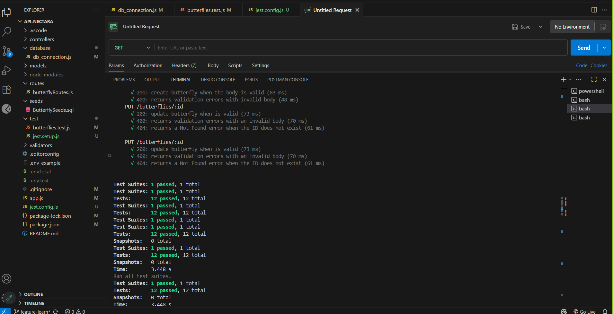
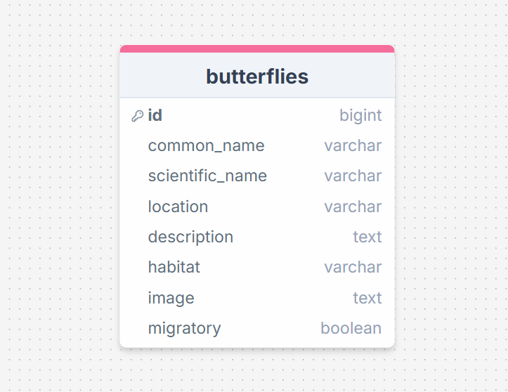

# API Nectara - Butterfly Management API

Una API REST para la gestión de mariposas construida con Node.js, Express y **Sequelize** como ORM.

## 🦋 Características

- CRUD completo para mariposas
- Base de datos MySQL con **Sequelize ORM**
- Tests automatizados con Jest y Supertest
- Validaciones de datos
- Configuración para desarrollo y testing
- CORS habilitado para frontend

## 🛠️ Tecnologías

- **Node.js** - Runtime de JavaScript
- **Express.js** - Framework web
- **Sequelize** - ORM para bases de datos SQL
- **MySQL** - Base de datos relacional
- **Jest** - Framework de testing
- **Supertest** - Testing de APIs HTTP
- **dotenv** - Gestión de variables de entorno

## 📋 Requisitos

- Node.js 16+
- MySQL 8.0+
- npm o yarn

## 🚀 Instalación

1. Clona el repositorio y entra al directorio
2. Instala dependencias: `npm install`
3. Instala nodemon (elige una opción):
   - Global: `npm install -g nodemon`
   - Dev dependency: `npm install --save-dev nodemon`
4. Configura variables de entorno en `.env` y `.env.test`
5. Crea las bases de datos: `nectara_db` y `nectara_test_db`
6. Inicia el servidor: 
   - Desarrollo: `npm run dev` (con nodemon)
   - Producción: `npm start`

## 🗃️ Sequelize - ORM Principal

Este proyecto utiliza **Sequelize** como ORM para interactuar con MySQL de manera elegante y eficiente.

### ⚙️ Configuración

- **Conexión**: Configurada en `database/db_connection.js` con variables de entorno
- **Modelo**: `ButterflyModel` define la estructura de datos con validaciones
- **Sincronización**: Automática en desarrollo, controlada en producción

### 🎯 Operaciones CRUD

- **Create**: `ButterflyModel.create()` - Crear nuevas mariposas
- **Read**: `ButterflyModel.findAll()` y `findByPk()` - Obtener datos
- **Update**: `ButterflyModel.update()` - Actualizar registros
- **Delete**: `ButterflyModel.destroy()` - Eliminar registros

### 🧪 Testing

Los tests usan una base de datos separada (`nectara_test_db`) para mantener la integridad. Cada test crea y limpia sus propios datos usando los métodos de Sequelize.



## 🗃️ Base de Datos

El proyecto utiliza MySQL como base de datos relacional. La estructura de la tabla `butterflies` se muestra a continuación:



## 📁 Estructura del Proyecto

```
API-Nectara/
├── controllers/          # Controladores de la API
├── database/            # Configuración de Sequelize
├── models/              # Modelos de Sequelize
├── routes/              # Rutas de Express
├── seeds/               # Datos iniciales
├── test/                # Tests con Jest
├── validators/          # Validaciones
└── app.js              # Configuración principal
```

## 🚀 Comandos Disponibles

- `npm start` - Iniciar servidor en producción
- `npm run dev` - Ejecutar con nodemon (desarrollo)
- `npm test` - Ejecutar todos los tests

## 📚 Endpoints

| Método | Endpoint | Descripción |
|--------|----------|-------------|
| GET | `/butterflies` | Obtener todas las mariposas |
| GET | `/butterflies/:id` | Obtener mariposa por ID |
| POST | `/butterflies` | Crear nueva mariposa |
| PUT | `/butterflies/:id` | Actualizar mariposa |
| DELETE | `/butterflies/:id` | Eliminar mariposa |

## 🔧 Ventajas de Sequelize

- ✅ **Abstracción de BD** - Código independiente del motor
- ✅ **Validaciones automáticas** - Tipos y constraints
- ✅ **Migraciones** - Control de versiones de esquemas
- ✅ **Relaciones** - Manejo fácil entre modelos
- ✅ **Transacciones** - Soporte nativo
- ✅ **Query builder** - Consultas complejas simplificadas
- ✅ **Pools de conexión** - Gestión automática

## 👥 Créditos y Equipo

Este proyecto fue posible gracias a la colaboración de dos equipos especializados.

### Equipo de Frontend
- [Aday Álvarez](https://github.com/adayalvarez)
- [Anngy Pereira](https://github.com/angiepereir)
- [Sofia Reyes](https://github.com/Sofiareyes12)
- [Ana Muruzabal](https://github.com/AnaMurbl)

### Equipo de Backend
- [Paloma Gómez](https://github.com/Pal-cloud)
- [Gema Yébenez](https://github.com/gemayc)
- [Maryori Cruz](https://github.com/MaryoriCruz)
- [Ana Muruzabal](https://github.com/AnaMurbl)
- [Camila Arenas](https://github.com/mcarenashd)
